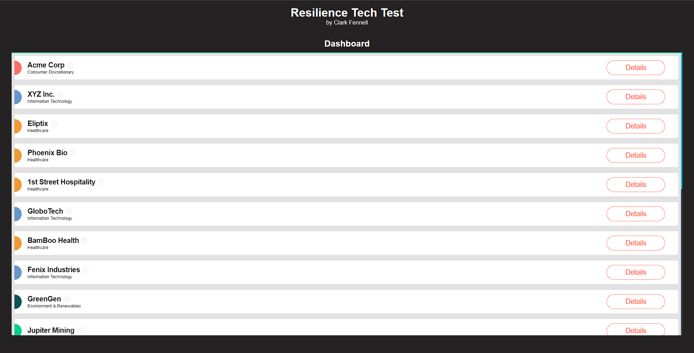
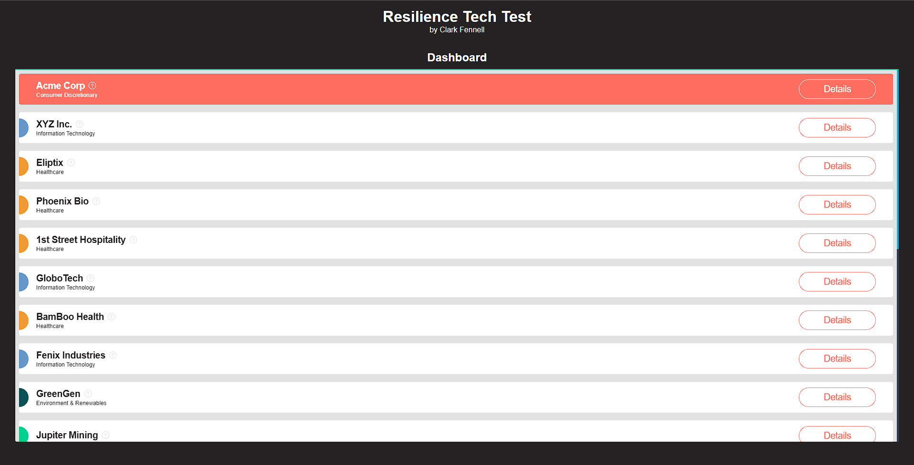
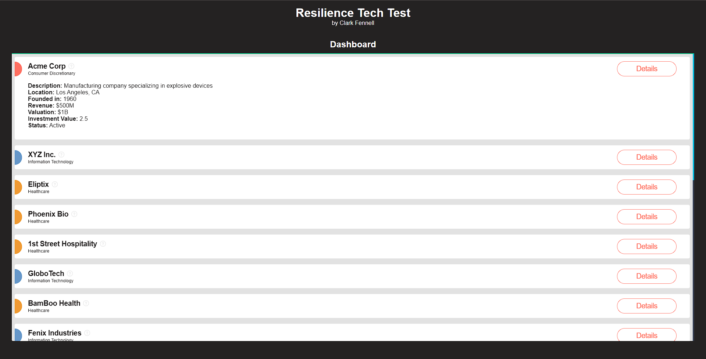
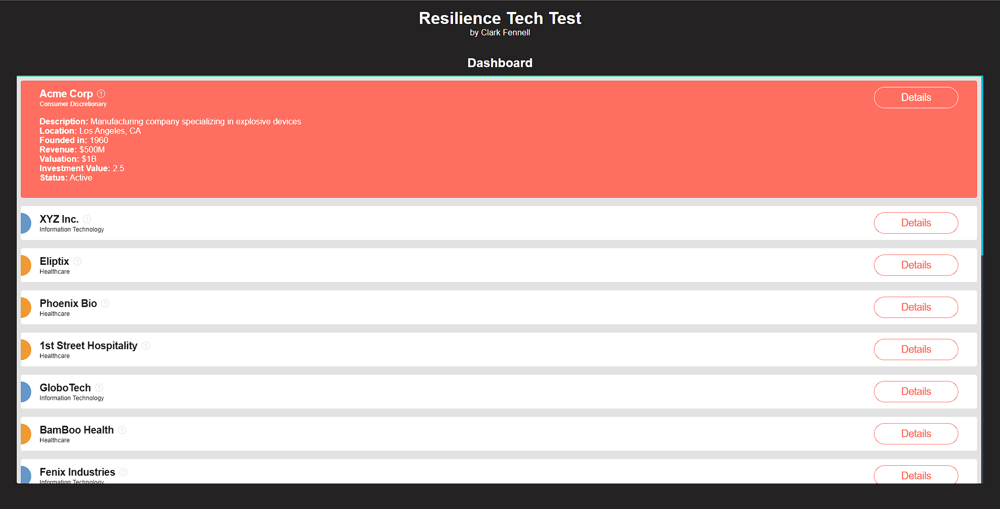
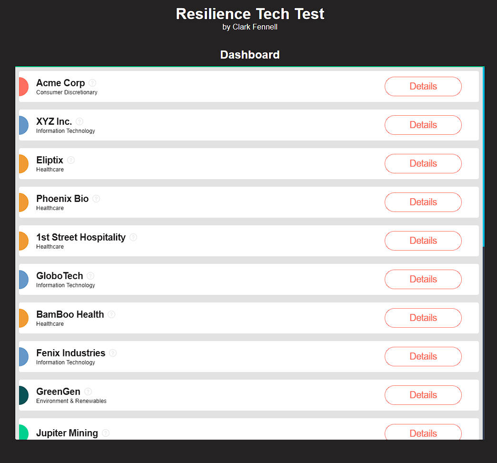
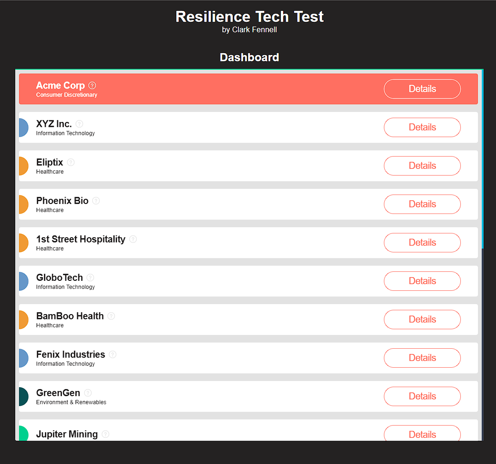
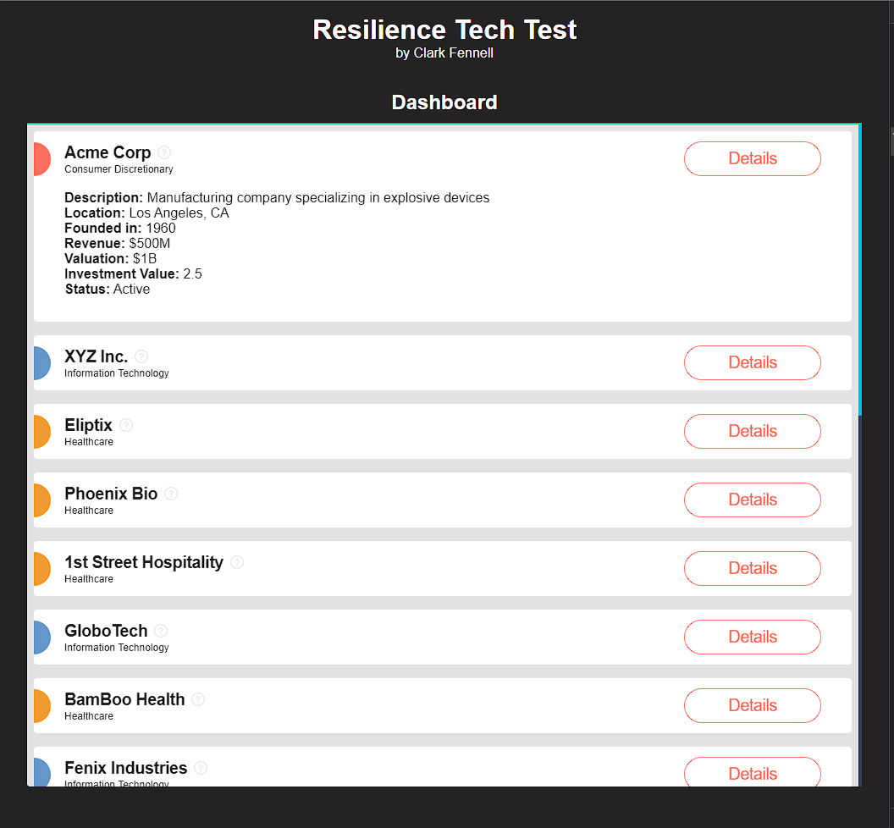
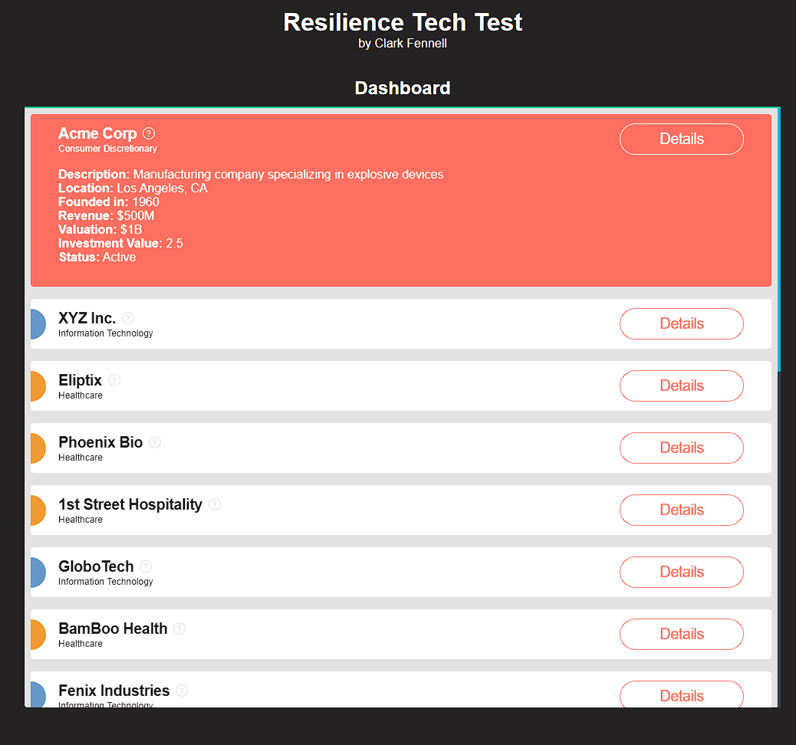
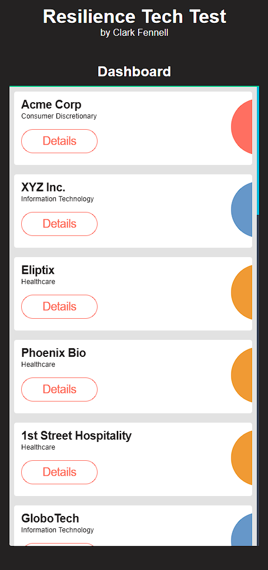
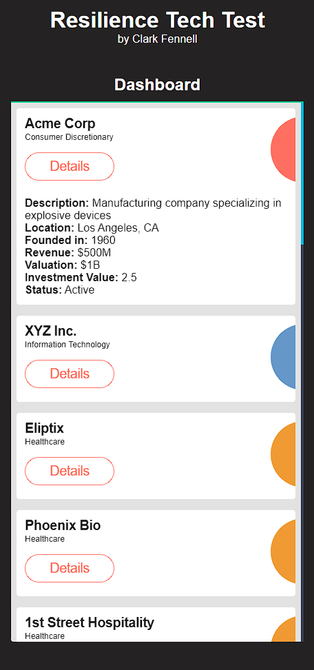

# Frontend Challenge

## Setup Instructions

1. Clone this repository
2. cd into the /resilience-tech-test directory
3. Type the following command to install the dependencies and run the project

```
yarn install && yarn dev
```

4. Open [http://localhost:3000](http://localhost:3000) with your browser to see the result.

**This technical test aims to evaluate the candidate's basic ability to work with a JS Framework by creating a basic dashboard, importing reusable components, and handling data / sanitization.**

_Please complete the following tasks and submit your code using a Git repository. Include clear instructions on how to set up and run your solution in a README.md file._

## Acceptance Criteria:

##### :wrench: The application should:

###### _Task 1: Basic Dashboard_

- [x] Create a simple project using your chosen framework with the following structure:

```
- src
    - components
        - Dashboard
        - ReusableComponent
    - App
    - data.js
```

- [x] Develop a basic dashboard in the `Dashboard` component that displays a list of items, importing the data from data.js. Use the provided wireframe as a reference for the layout and design.

###### _Task 2: Reusable (list item) Component_

- [x] Build and use a reusable component to display the company information -> company name, previous names and sectors.
- [x] Using the data imported to the dashboard, pass down the relevant required data for the component.
- [x] The coloured blobs visually represent the sector of the company.
- [x] Build a tooltip, when a user hovers over the question mark symbol, the black helper box appears and provides more information, when they hover away it disappears.
- [x] Sanitise the data, decide how to handle any missing fields, special characters.

###### _Personal Additions Once Task Are Complete_

- [x] Add more details section on click
- [x] Add a custom scroll bar
- [x] Add a scroll reveal to reusable components inside the dashboard

###### _Notes_

- Used default colour for Sector is missing
- Checked for data if missing and filled in with default statements in more details section
- Checked for Previous Names, and looped through. If not Tool Tip does not show
- Checked for any data first and output a 'no data' message if data is not found
- Added responsive mobile designs to fit both web and mobile needs

###### <ins>_If I had more time_</ins>

- I would review any console log errors and try to solve them.
- I would look at the transitions and animations, and see if they can be improved
- I would have added more tests to check for mounting and transitions

###### _Full Design Implementation Screenshots_

- ###### Desktop ######
    - No Hover, Details Closed
        

    - Hover, Details Closed
        

    - No Hover, Details Open
        

    - Hover, Details Open
        

- ###### Tablet ######
    - No Hover, Details Closed
        

    - Hover, Details Closed
        

    - No Hover, Details Open
        

    - Hover, Details Open
        

- ###### Mobile ######
    - Details Closed
        

    - Details Opened
        